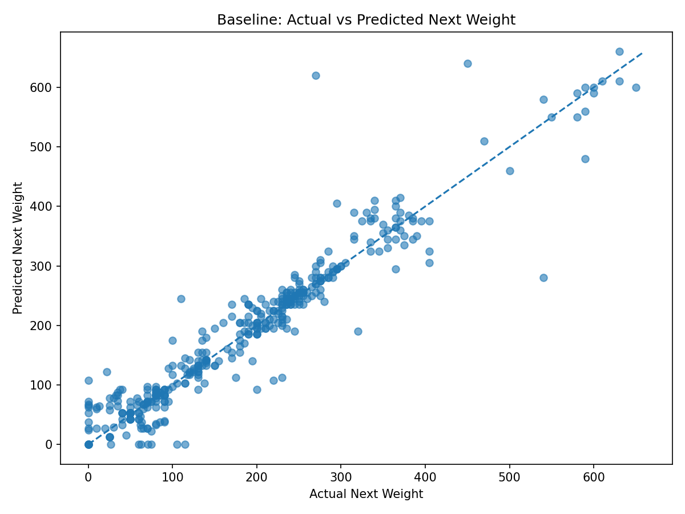
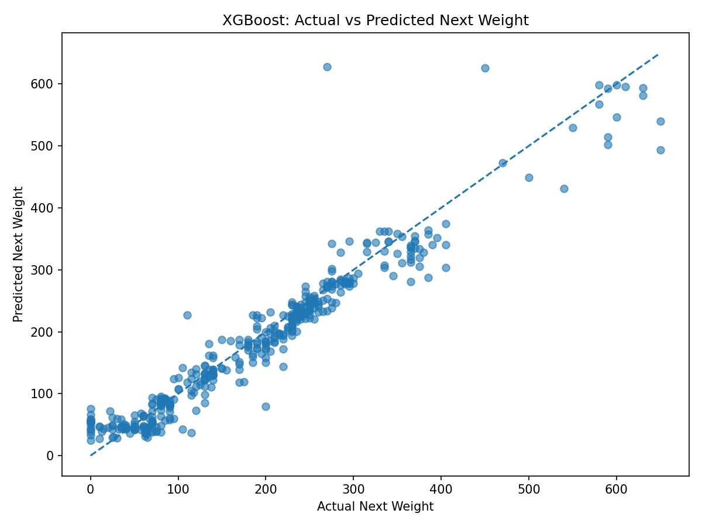
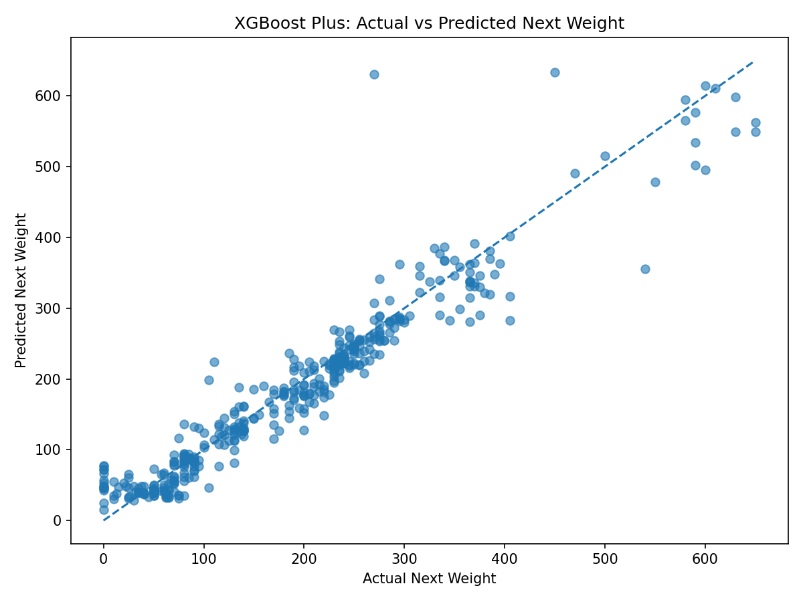

# 💪myGymBro

An AI-powered fitness coach that helps you log workouts, track progress, and get personalized training recommendations.

## What it Does

**myGymBro** is a Streamlit-based web application that allows users to log their workouts (exercise, sets, reps, weight, RPE/RIR), profile (experience level, equipment access, and training frequency), and fitness goal in-order to recieve intelligent training advice via an AI chatbox interface. The systems works to combine user workout history, user profile, goals, a retrieval-augmented knowledge base (RAG) of fitness resources and a trained machine learning model, tasked to predict the next weight of an exercise, to provide personalized recommendations. The goal of the application is to create a smarter and more interactive version of workout tracker applications, focusing on strength training and progression.

## Quick Start

The application can be accessed via the [website](https://mygymbroduke.streamlit.app) or ran locally.

### Run Locally

1.  **Clone the repository**
    ```bash
    git clone https://github.com/timphamleDUKE/myGymBro.git
    cd myGymBro
    ```
2.  **Install Dependencies**
    ```bash
    pip install -r requirements.txt
    ```
3.  **Add an API key for the chat model.**

    Create `.streamlit/secrets.toml` locally:

    ```toml
    LITELLM_TOKEN = "your-token-here"
    ```

    The app also supports `OPENAI_API_KEY` if you are using a compatible OpenAI endpoint. Do not commit `.streamlit/secrets.toml`; it is intentionally ignored by git.

4.  Launch the app

    ```bash
    streamlit run app/app.py
    ```

    For more information on set-up and reproducibility, please refer to [SETUP.md](./SETUP.md)

## Video Links

- [**Demo Video**](https://youtu.be/6ITeRZiAfHg)
- [**Technical Walkthrough**](https://youtu.be/IhFlE3sCBrs)

## Data Sources

This project contains workout data pulled from [721 Weight Training Workouts](https://www.kaggle.com/datasets/joep89/weightlifting) on Kaggle. The data is 3 years worth of recorded exercise from a Kaggle user, Joe89, using the STRONG app. For RAG context, it utilizes various workout article and Youtube video links. For more information on data sources, please refer to [ATTRIBUTION.md](./ATTRIBUTION.md)

## Approach

Many workout tracking apps on the market are useful, but they rarely contain actionable coaching. myGymBro tackles this common gap by combining three sources of information into a chatbox experience that is more personalized:

- **User state:** workout logs, profile, goals, training frequency, and equipment access.
- **Fitness knowledge:** a retrieval-augmented generation (RAG) pipeline built from articles and videos about strength training, hypertrophy, programming, recovery, and progression.
- **Predictive modeling:** next-weight prediction models that estimate a reasonable load progression from previous workout history.

The project is organized as a multi-stage pipeline. In this demo application, raw workout data is cleaned into user-facing workout rows, supervised labels are created with `actual_next_weight`, baseline, XGBoost, and XGBoost-plus models are trained/evaluated, RAG embeddings are built from the knowledge base, and the Streamlit app combines all of those outputs at prompt time. The app is session-only for demo users: every visitor starts with the same seeded workout history, but their profile, chat, prompt usage, and new workout logs stay private to their session.

## Solution

The application is a Streamlit web app with four main pages:

- **Dashboard:** summarizes workout count, chat message count, saved profile status, latest workout logs, and the user's currently saved profile details.
- **Workout Logger:** lets users log and view a history of their exercises along with the corresponding sets, reps, weight, date, RPE, and RIR.
- **Profile & Goals:** stores session-specific training context such as a primary goal, experience level, equipment access, and prefered weekly training frequency.
- **Coach Chat:** streams responses from an LLM and uses private app context to personalize recommendations.

The coach chat is the core experience. When the user asks a question, the app builds a private context block from retrieved training resources, recent workout history, profile details, and, depending on the question, a next-weight prediction. That context is sent to the LLM as system-level app context, while the user's actual question remains a normal user message. This avoids replies that say "based on the context you provided" and makes the assistant feel more like an integrated coach.

The seeded dataset for the demo simulates a user that has been importing their workouts into myGymBro for some time. The use of the seeded dataset allows us to train, test, and use the ML component during inference.

The ML component includes three next-weight prediction approaches:

- **Baseline:** rule-based progression using exercise type, current weight, RPE/RIR, and conservative increment logic.
- **XGBoost:** a learned regression model using workout history features and one-hot encoded exercise features.
- **XGBoost-plus:** category-specific XGBoost models grouped by movement type, such as upper compound, lower compound, isolation, and bodyweight.

The RAG component uses transformer embeddings to retrieve relevant chunks from the fitness knowledge base. The retrieved chunks are then scored based on similarity to the user query and further reranked based on meta-data tags, trusted domains, and low-value text markers ("in this video", "today we're", "thanks for watching", etc.). Retrieved chunks are combined with user data and model predictions before the final LLM response is streamed back to the UI.

## Evaluation

### Controlled Experimental Setup

The next-weight models were evaluated on a held-out test split of 420 workout rows (80-20 ratio). Metrics include mean absolute error, root mean squared error, mean squared error, and mean signed error.

### Results

| Model        |    MAE |   RMSE |      MSE | Mean Signed Error | Within 2.5 lb | Within 5 lb | Within 10 lb |
| ------------ | -----: | -----: | -------: | ----------------: | ------------: | ----------: | -----------: |
| Baseline     | 21.938 | 38.849 | 1509.263 |             2.098 |        23.81% |      37.38% |       50.24% |
| XGBoost      | 21.979 | 35.188 | 1238.165 |            -5.999 |         7.38% |      19.29% |       37.14% |
| XGBoost-plus | 23.201 | 36.725 | 1348.691 |            -5.283 |         7.38% |      16.90% |       35.48% |



From the table, we see that the baseline model had the best MAE and close-threshold accuracy, suggesting that conservative rule-based progression is strong for this dataset. This may be due to it encoding domain-specific conservative progression rules which align to how real world lifters increment their weights.



XGBoost produced the loweset RMSE and MSE, reducing larger errors but being less accurate within the 2.5/5/10lb thresholds. This model works to optimize the global error and may predict intermediate values that reduce large errors but are less aligned with the discrete plate increments in contrast to the baseline model.



Despite XGBoost-plus having category-specific XGBoost model based on movement type, it did not outperform the simpler XGBoost model. This is likely due to the reduced amount of training data available to each sub-model after splitting the data by exercise category.

### Error Analysis

There are many ways the various models could have performed poorly on the testing data and during inference time:

- Bodyweight exercises introduce inconsistent and noisy targets
- High RPE (9-10) exercises could be harder to predict for progression, especially for this seeded dataset which did not contain RPE or RIR measures
- The variability of exercises introduce noise

### Final Implementation

For the final app behavior, we utilize a hybrid approach with the baseline and XGBoost model approach. Based on the amount of workout data the user has logged, the app will choose between using the baseline and XGBoost model during inference. This hybrid approach provides more reliable next weight recommendations for users with limited data while also improving performance as more personalized workout history becomes available. If the user-query is flagged as a prediction question, the appropriate model is used and its output is used as context for the LLM to suggest a safe recommendation for next weight progression.
